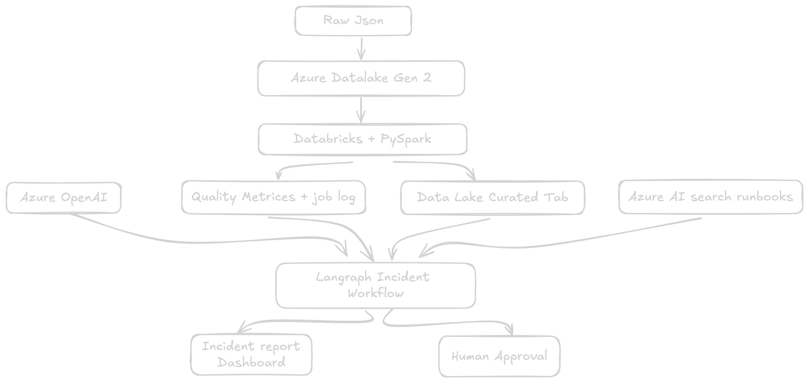

# Dataops-Copilot

DataOps Copilot: an agentic data-quality and incident-response system for an Azure data lake.
[GitHub repository](https://github.com/wp225/dataops-copilot)

## System overview


### Ranking overview


## Workflow

```text
/setup → /scrape → /rank → /apply <job_id>
```

1. **Setup** creates or incrementally updates a private candidate profile from a CV and confirmed user information.
2. **Scrape** collects current public postings from configured Greenhouse and Lever job boards.
3. **Rank** runs compact triage across collected jobs and produces a shortlist.
4. **Apply** performs a detailed evaluation for one job. After user approval, it creates and verifies tailored application materials.

## Multi-agent application workflow

The `/apply` workflow separates drafting from review:

```text
Candidate profile + job posting
             ↓
      Full fit evaluation
             ↓
      Resume / letter drafter
             ↓
 Independent reviewer subagent
             ↓
  Evidence-grounded revision
             ↓
 PDF, ATS, and consistency checks
```

The reviewer does not invent or edit candidate facts. It returns a critique focused on factual grounding, requirement coverage, genuine gaps, and keyword relevance. The main workflow applies only evidence-supported changes.

## Privacy by design

Candidate-specific data stays local:

* Original CVs
* Completed candidate profiles
* Per-job evaluations
* Generated resumes and cover letters
* Application tracker records

The repository commits reusable templates and workflow definitions, not personal application data.

## Start here

Install dependencies:

```bash
uv sync
```

Then open the repository in Claude Code and run:

```text
/setup
```

See the command documentation for the complete workflow.
